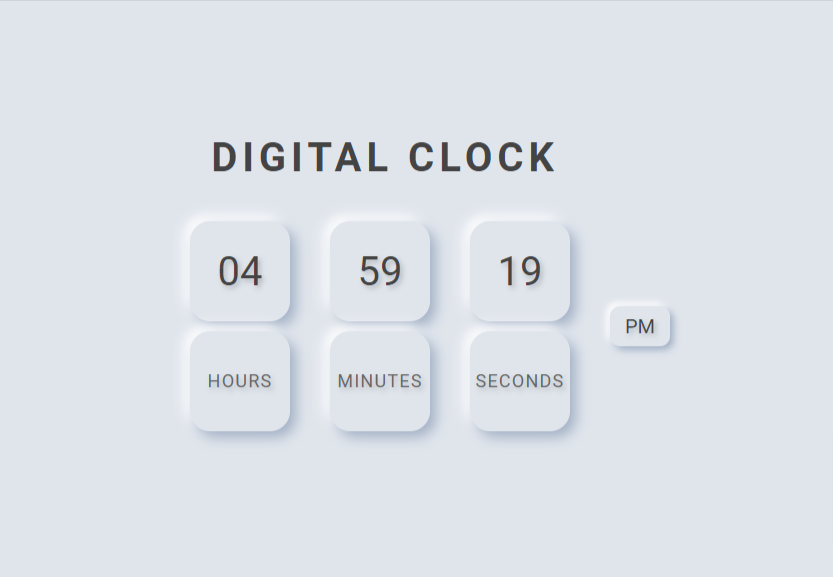

# Digital Clock Plugin

A customizable digital clock plugin implemented in JavaScript and CSS, using Shadow DOM for style encapsulation.

## Features

- **12-hour or 24-hour format**: Option to display time in either format.
- **Customizable appearance**: Adjust background color, text color, font family, and font size.
- **Encapsulated styling**: Styles are encapsulated using Shadow DOM to avoid conflicts with other page styles.
- **Responsive design**: Adjusts for smaller screen sizes.

## Installation

1. Clone the repository or download the source files.
2. Include the `clock.js` files in your HTML file.

## PREVIEW



## Usage

Include the following code in your HTML file:

```html
<!DOCTYPE html>
<html lang="en">
<head>
    <meta charset="UTF-8">
    <meta name="viewport" content="width=device-width, initial-scale=1.0">
    <title>Digital Clock Plugin Test</title>
</head>
<body>

<!-- Container for the clock -->
<div id="clockContainer"></div>

<!-- Link to the JavaScript file -->
<script src="./dist/clock.js"></script>
<!-- Initialize the DigitalClock plugin with custom options -->
<script>
    new DigitalClock('clockContainer', {
        bgColor: '#e0e5ec',
        color: '#444',
        format: '12', // Options: '12' or '24'
        fontFamily: 'Roboto',
        fontSize: '2rem'
    });
</script>

</body>
</html>